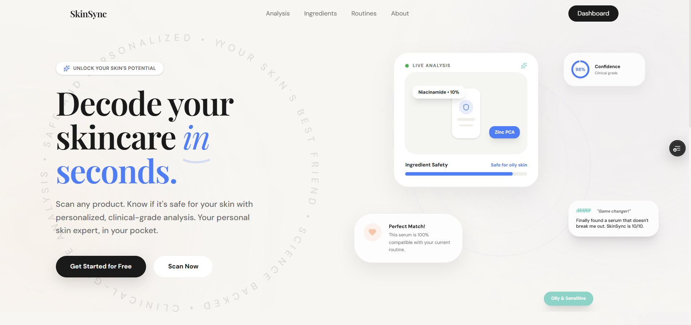
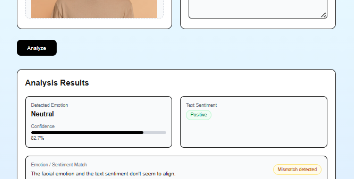
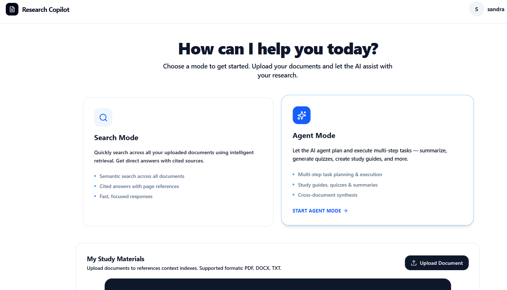
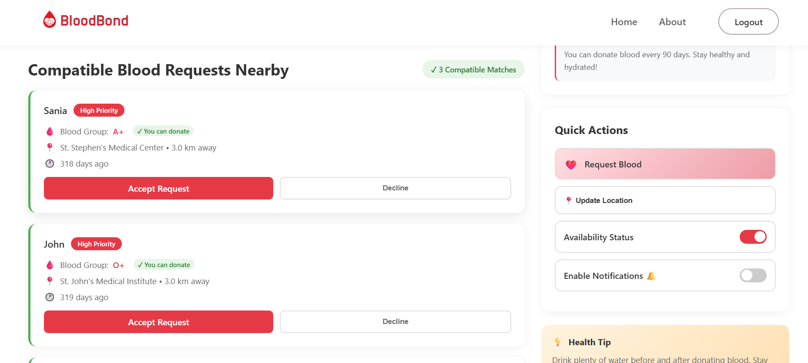
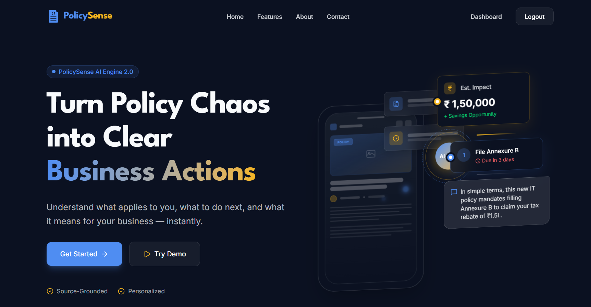

# Sandra Rosa Prince

### Web Developer • AI/ML Enthusiast • Product Builder

Building web applications and AI-powered products with a focus on practical engineering, clean interfaces, and useful product experiences.

 

---

## Featured Projects

<!--
PROJECT IMAGE SETUP
1. Create this folder in your profile repository:
   /assets/projects/

2. Add project screenshots there, for example:
   /assets/projects/skinsync.png
   /assets/projects/policysense.png
   /assets/projects/student-performance.png

3. Use relative paths in the image tags below:
   ./assets/projects/skinsync.png

Recommended screenshot:
- 16:9 or approximately 1200 × 675 px
- Capture the most useful/recognizable part of the application
- Keep all project thumbnails visually consistent
- PNG or WebP works well

You can also use an external image URL instead of a local file.
-->

<table>
<tr>

<td width="50%" valign="top">

### HemoLens

Non-invasive preliminary anemia screening using lower eyelid and nail-bed images, combined with a context-aware AI assistant.

`Next.js` `Supabase` `Python` `OpenCV` `MediaPipe` `Gemini`

[Repository](https://github.com/Sandraa16012007/hemolens)

</td>

<td width="50%" valign="top">

### SkinSync

Privacy-first local AI skincare assistant that analyzes product ingredients and provides personalized insights.

`React` `TailwindCSS` `OCR/VLM+LLM` `RunanywhereSDK` `Qwen`

[Live Demo](https://skin-sync-orcin.vercel.app/) · [Repository](https://github.com/Sandraa16012007/SkinSync)

</td>

</tr>

<tr>

<td width="50%" valign="top">

### Emotion Sentiment Fusion Detector

Multimodal AI system combining facial emotion recognition and sentiment analysis to identify emotion-text mismatches, sarcasm, and hidden frustration.

`Python` `NLP` `CNN` `TensorFlow` `FastAPI` `Next.js` `Render/Vercel`

[Live Demo](https://emotion-sentiment-fusion-detector.vercel.app/) · [Repository](https://github.com/Sandraa16012007/emotion-sentiment-fusion-detector)

</td>

<td width="50%" valign="top">

### Agentic Research Copilot

An agentic multi-document RAG research assistant that answers queries across multiple documents with user-isolated knowledge bases.

`Python` `FastAPI` `FAISS` `BM25` `Cloudinary` `Firebase` `RAG` 

[Repository](https://github.com/Sandraa16012007/agentic-research-copilot)

</td>

</tr>

<tr>

<td width="50%" valign="top">

### BloodBond

Web application connecting blood donors with people in urgent need using location-aware matching.

`HTML` `CSS` `JavaScript` `Firebase`

[Live Demo](https://sandraa16012007.github.io/BloodBond/) · [Repository](https://github.com/Sandraa16012007/BloodBond)

</td>

<td width="50%" valign="top">

### PolicySense

AI-native personalization layer designed to transform unstructured news into decision-ready intelligence.

`React` `Next.js` `Tailwind CSS` `Gemini API` `Firebase`

[Live Demo](https://policysense-yb5h.vercel.app/) · [Repository](https://github.com/Sandraa16012007/policysense)

</td>

</tr>

<!--
ADD MORE PROJECTS BY COPYING THE <tr>...</tr> BLOCK ABOVE.

For example:

<tr>
<td width="50%" valign="top">

### Project Name

Short, technically specific description of what the project does.

`Technology` `Technology` `Technology`

[Live Demo](YOUR_DEMO_URL) · [Repository](YOUR_REPO_URL)

</td>

<td width="50%" valign="top">

...
</td>
</tr>
-->

</table>

---

## Technologies

  

---

## About

I'm a B.Tech student and developer interested in building products at the intersection of web engineering and AI.

My work spans frontend development, AI/ML applications, APIs, data-driven systems, and product-focused interfaces. I enjoy taking an idea from a rough concept to a working application and understanding the engineering decisions behind it.

- Building web applications with React, Next.js, JavaScript, and modern frontend tooling
- Exploring AI/ML, LLM applications, RAG, and intelligent product workflows
- Interested in product engineering, developer tools, and practical AI systems
- Currently strengthening full-stack development and software engineering fundamentals

---

## Let's Connect

I'm interested in opportunities involving frontend engineering, full-stack development, AI/ML, and product engineering.

  <a href="YOUR_LINKEDIN_URL">LinkedIn</a> ·
  <a href="YOUR_PORTFOLIO_URL">Portfolio</a> ·
  <a href="mailto:YOUR_EMAIL">Email</a>

---

Building, learning, and shipping one project at a time.

